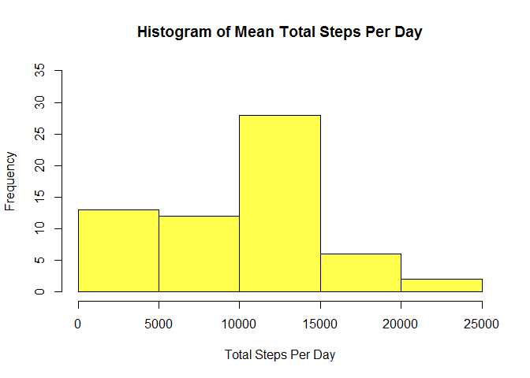
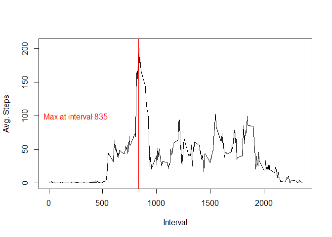
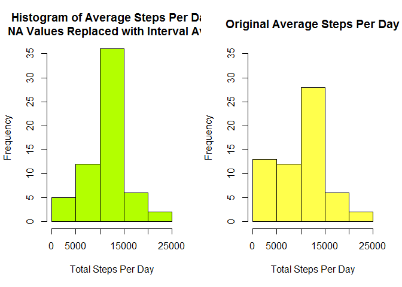
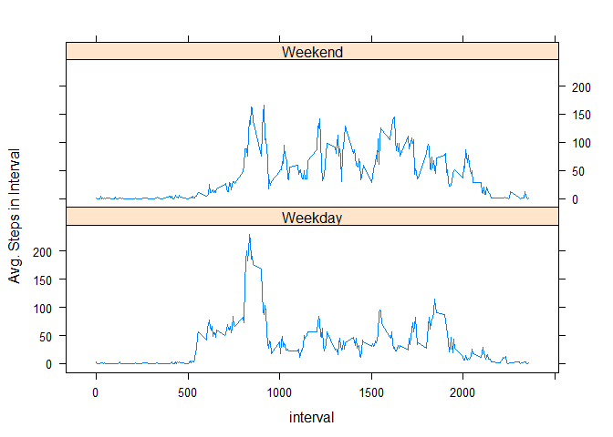

# Reproducible Research: Peer Assessment 1


## Loading and preprocessing the data
The data for this assignment can be downloaded from the course web site:

Dataset: Activity monitoring data [52K]
The variables included in this dataset are:

steps: Number of steps taking in a 5-minute interval (missing values are coded as NA)

date: The date on which the measurement was taken in YYYY-MM-DD format

interval: Identifier for the 5-minute interval in which measurement was taken

The dataset is stored in a comma-separated-value (CSV) file and there are a total of 17,568 observations in this dataset.

The data is included as a zip file in the assignment repository. Unzip and load the data as a data frame "step_data". Change the date value so they can be manipulated later.

```r
if(!file.exists("activity.csv")) unzip("activity.zip")
step_data<- read.csv("activity.csv")
step_data$date<- as.POSIXct(as.character(step_data$date))
```


## What is mean total number of steps taken per day?

Use the dplyr package to group the data by date and then calculate the mean for all days -- for now, removing any NA values. 

```r
library(dplyr)
daily_totals<- step_data %>%  
          group_by(date)%>%
          summarize( sum(steps, na.rm = TRUE))
colnames(daily_totals)<- c("date", "steps")
par(mfrow=c(1,1))
hist(daily_totals$steps, ylim= c(0,35),breaks=5,col=rgb(1,1,0,0.7), main = paste("Histogram of Mean Total Steps Per Day"), xlab ="Total Steps Per Day", cex =2)
```

 

Calculate the mean number of steps per day.

```r
mean(daily_totals$steps) 
```

```
## [1] 9354.23
```
Determine the median number of steps per day.

```r
median(daily_totals$steps)
```

```
## [1] 10395
```

## What is the average daily activity pattern?
Make a time series plot (i.e. type = "l") of the 5-minute interval (x-axis) and the average number of steps taken, averaged across all days (y-axis)


```r
daily_intervals<- step_data %>%  
    group_by(interval)%>%
    summarize( mean(steps, na.rm = TRUE))
colnames(daily_intervals)<- c("interval", "avg_steps")

plot(x= daily_intervals$interval, y= daily_intervals$avg_steps, type ="l", ylab="Avg. Steps", xlab="Interval")
abline(v= daily_intervals$interval[daily_intervals$avg_steps >=max(daily_intervals$avg_steps, na.rm = TRUE)], col="red")
text(150,100, "           Max at interval 835", col ="red", cex =1)
```

 

The maximum average steps among all intervals takes the maximum of the calculated values.

```r
daily_intervals$interval[daily_intervals$avg_steps >=max(daily_intervals$avg_steps, na.rm = TRUE)]
```

```
## [1] 835
```
## Imputing missing values
The number of NA values in the data set is determined below.

```r
sum(is.na(step_data$steps))
```

```
## [1] 2304
```
To eliminate the NA values, a second dataframe is created "step_data_2".  The NA values are replaced with the average step count value for the particular interval.

```r
step_data_2<- step_data
for(i in 1: nrow(step_data_2)){
    if (is.na(step_data_2$steps[i])){
     step_data_2$steps[i]<- as.numeric(daily_intervals[(daily_intervals$interval == step_data_2$interval[i]),2])
    }
   }

daily_totals_2<- step_data_2 %>%  
    group_by(date)%>%
    summarize( sum(steps, na.rm = TRUE))
colnames(daily_totals_2)<- c("date", "steps")
```
A histogram for the inputed values is plotted alongside the original histogram.

```r
par(mfrow=c(1,2))
daily_totals_2_hist<-hist(daily_totals_2$steps, main = paste("Histogram of Average Steps Per Day\nNA Values Replaced with Interval Avg."),ylim= c(0,35), xlab ="Total Steps Per Day", cex =2, col=rgb(0.7,1,0,1))
daily_totals_hist<-hist(daily_totals$steps, ylim= c(0,35),breaks=5,col=rgb(1,1,0,0.7), main = paste("Original Average Steps Per Day"), xlab ="Total Steps Per Day", cex =2)
```

 

```r
par(mfrow =c(1,1))
```
Counts for the quantiles shown in the histograms above show that replacing the NA values has cut the number of days with low step counts and increased days with more typical counts.

```r
quantiles<- c(1:5)
Includes_NA<- daily_totals_hist$count
Has_imputed_values<- daily_totals_2_hist$count

comparison<- data.frame(quantiles, Includes_NA, Has_imputed_values)
comparison
```

```
##   quantiles Includes_NA Has_imputed_values
## 1         1          13                  5
## 2         2          12                 12
## 3         3          28                 36
## 4         4           6                  6
## 5         5           2                  2
```

## Are there differences in activity patterns between weekdays and weekends?

Using the imputed value version of the data, days need to be categorized as weekday or weekend.

```r
step_data_2$weekday<- ifelse(weekdays(step_data_2$date) %in% c("Saturday", "Sunday"), "Weekend" ,"Weekday")

daily_intervals_2<- step_data_2 %>%  
    group_by(weekday,interval)%>%
    summarize( mean(steps, na.rm = TRUE))
colnames(daily_intervals_2)<- c("weekday", "interval", "avg_steps")
```
Plot average steps by interval for weekdays and weekends.


```r
library(lattice)
xyplot(avg_steps ~ interval |weekday, daily_intervals_2, layout = c(1,2), type = "l", ylab = "Avg. Steps in Interval")
```

 

